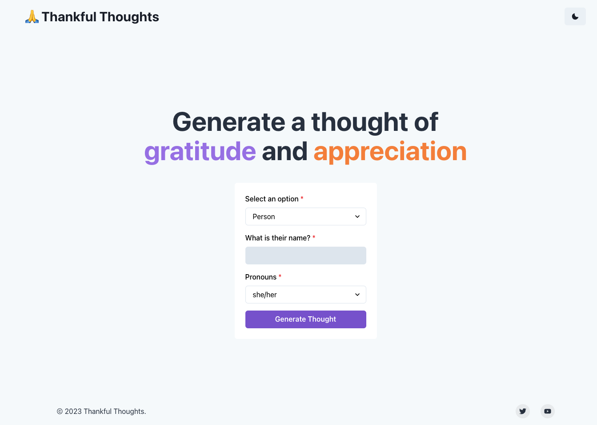

# [ThankfulThoughts.io](https://thankfulthoughts.io/)


[](https://www.thankfulthoughts.io)

## How it works


## Running Locally

After cloning the repo, go to Open AI (https://beta.openai.com/) to make an account and put your API key in a file called `.env`. 

Then, run the application in the command line and it will be available at `http://localhost:3000`.

```bash
npm install
npm run dev
```
